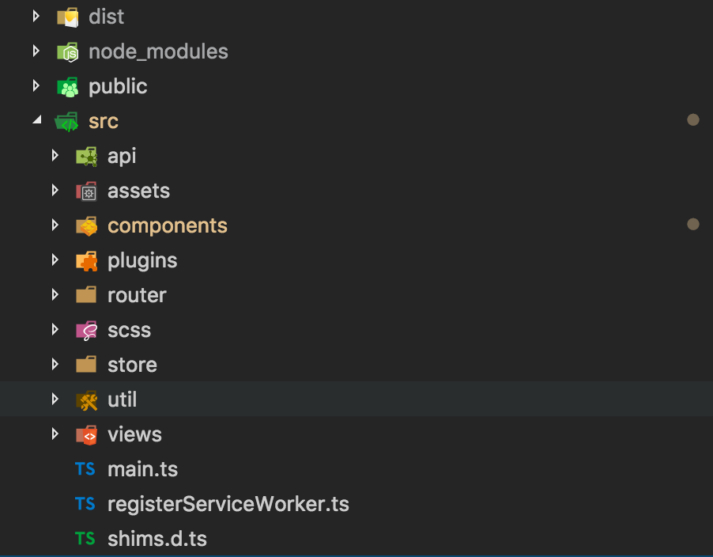

# vue练手项目

### 目的

这个项目主要是用vue+vuex实现一个单页面应用，纯粹是熟悉vue全家桶相关开发模式，用于练手非常合适。

着手开发完了之后可以学的东西：

1. 熟悉vue单文件组件开发方式
2. 熟悉如何写一个vue插件
3. 熟悉如何使用vue-router以及挂载路由钩子函数
4. 熟悉vuex是如何运作的，模块化维护应用状态数据
5. 体验typescript的开发方式

如果想学vue的不妨进来看看。

### 技术栈

* vue
* vuex
* vue-router
* typescript

 ### 开始

开始之前，还是有必要去vue官网学习一下vue，至少得有个大致的了解，后面在用到vue-router和vuex时，再去对应的仓库看文档就可以了。

* [vue官网地址](https://cn.vuejs.org/v2/guide/)
* [vue-router地址](https://router.vuejs.org/)
* [vuex地址](https://vuex.vuejs.org/)

创建项目可以用vue-cli，具体看[这里](https://github.com/vuejs/vue-cli/blob/dev/docs/README.md)

### 结构

项目结构一般来说非常重要，定义好的目录结构，非常利于后续的项目维护，以及别人阅读理解。下面就是这个项目的结构，应该看一下就知道是干什么的，大致说一下。

项目结构分为静态资源目录，api接口请求目录，组件目录，插件目录，路由配置目录，公共样式目录，状态维护目录，工具类目录，页面视图目录。



### 单页面组件

vue开发一般都是单页面组件的方式，即一个以vue为后缀的文件就是一个组件，组件里包含了template模版，script脚本，style样式，组件内的逻辑可以完全封装在里面，对外可以提供接受的Props数据，可以对外发射一个事件emit，或者将外部组件组合到自己内部的slot里面。

```vue
<template>
  <div class="topNav">
    <ul class="list">
      <li class="item left">
        <app-icon :link="left" @click.native.stop="clickLeft" />
      </li>
    </ul>
  </div>
</template>

<script lang="ts">
import { Component, Prop, Emit , Vue } from 'vue-property-decorator';
import AppIcon from './AppIcon.vue';
import {PREFIX} from '@/store/modules/user/CONSTANTS';

@Component({
  components: {
    AppIcon,
  },
})
export default class TopNav extends Vue {
  @Prop({required: true})
  private left!: string;
  private get avatar() {
    return this.$store.state[PREFIX].avatar;
  }
  private clickLeft() {
    this.$emit('left');
  }
}
</script>

<style lang="scss" scoped>
@import '../scss/theme.scss';
.topNav {
  background: $topBarBgColor;
  position: fixed;
}
</style>
```

### 配置路由

由于在客户端渲染的单页面应用，需要在客户端配置路由，实现页面间的切换。开发vue时官方推荐使用vue-router，在配置这个项目时，由于考虑登录态的维护，所以对路由配置加了meta数据，并增加了路由跳转钩子函数，进行鉴权控制受登录态的页面。

```typescript
import Vue from 'vue';
import Router from 'vue-router';
import Sign from '@/views/Sign.vue';
import Me from '@/views/Me.vue';
import { hasLogin } from '@/util/session';

Vue.use(Router);

const router = new Router({
  mode: 'history',
  routes: [
    {
      path: '/',
      name: 'sign',
      component: Sign,
    },
    {
      path: '/me',
      name: 'me',
      component: Me,
      meta: { requiredAuth: true },
    },
  ],
});

router.beforeEach((to, from, next) => {
  if (to.matched.some((record) => record.meta.requiredAuth)) {
    // this route requires auth, check if logged in
    // if not, redirect to login page.
    if (!hasLogin()) {
      next({
        path: '/',
        query: { redirect: to.fullPath },
      });
    } else {
      next();
    }
  } else {
    next(); // 确保一定要调用 next()
  }
});

export default router;
```

### vue插件编写

对于那种需要全组件共享，或者全局注入的方法等可以使用vue插件。其实，vue-router和vuex实际就是vue的插件，在入口处，调`Vue.use(Router);` 就可以了，比如 `Vue.use(Router);`

一个插件，可以是一个函数，或者一个包含`install`方法的对象，在调用`Vue.use`时，会调用`install`方法。

在插件里，我们可以

1. 添加全局方法或者属性，
2. 添加全局资源
3. 通过全局 mixin 方法添加一些组件选项
4. 添加 Vue 实例方法

```typescript
import Vue, { VueConstructor, PluginObject } from 'vue';
import Loading from './Loading.vue';

type ShowFunc = () => () => void;

const plugin: PluginObject<{}> = {
  install(Vue: VueConstructor, options = {}) {
    const CONSTRUCTOR = Vue.extend(Loading);
    let cache: Vue & { show: ShowFunc } | null = null;

    function loading(): () => void {
      const loadingComponent = cache || (cache = new CONSTRUCTOR());
      if (!loadingComponent.$el) {
        const vm = loadingComponent.$mount();
        (document.querySelector('body') as HTMLElement).appendChild(vm.$el);
      }
      return loadingComponent.show();
    }
    Vue.prototype.$loading = loading;
  },
};

export default plugin;
```

### 状态管理

单页面应用的状态管理使用vuex，上面提到了，它就是一个vue的插件，会在组件实例上注入$store对象，这个对象就是`new Vuex.Store()`,相比redux ，我觉得vuex简单很多。使用需要注意一下几点就可以了，

1. 改变state，始终是通过commit一个mutation方式进行，mutation函数里必须是同步改变state，不能异步改变state。对应redux中，就是reducer函数的功能了。
2. 对于异步改变state，可以通过dispatch一个action，action里面异步获取数据之后在commit一个对应的mutation。这个在redux里，是通过中间件处理异步action的。
3. 对于state的过滤筛选，可以定义getter，getter是缓存依赖的。
4. 对于大型复杂的state，可以采用模块化的方式管理各个模块的state，这个跟redux的思想是一样的。

本次项目也是用模块化的管理状态的方式，把整个应用的状态以业务划分为子状态，最后在modules中合并

```javascript
  modules: {
    user,
    list,
    filter,
  },
```

 对于单个模块的state，按照上面的注意点即可以。

```typescript
// user模块的state
import { ActionTree, MutationTree, ActionContext } from 'vuex';
import { login, loginOut, LoginInfo } from '@/api/login';
import { getUserInfo, getUserActions } from '@/api/user';
import { User } from './user';
import { RootState } from '../../rootstate';

const namespaced = true;

/* initial state */
const state = () => ({
  id: null,
  username: null,
  email: null,
  avatar: null,
  likes_count: null,
  goings_count: null,
  past_count: null,
});

/* user actions */
const actions: ActionTree<User, RootState> = {
  login({ commit, state }: ActionContext<User, RootState>, payload: LoginInfo) {
    return login(payload).then(
      ({ token, user }: { token: string; user: User }) => {
        commit('saveToken', token, { root: true });
        commit('saveUser', user);
      },
    );
  },
  getUserInfo({ commit, state }: ActionContext<User, RootState>) {
    return getUserInfo().then((user: User) => {
      commit('saveUser', user);
    });
  },
};

/* user mutations */
const mutations: MutationTree<User> = {
  saveUser(state, user) {
    state.id = user.id;
    state.username = user.username;
    state.email = user.email;
    state.avatar = user.avatar;
    state.likes_count = user.likes_count;
    state.goings_count = user.goings_count;
    state.past_count = user.past_count;
  },
};

export default {
  state,
  actions,
  mutations,
  namespaced,
};

```

